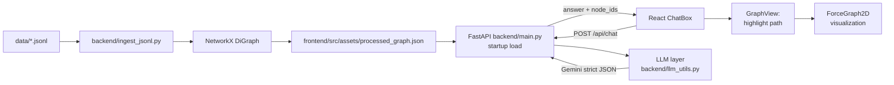

# Dodge AI ERP Context Graph Prototype

This repository contains a high-fidelity prototype built for the Dodge AI Forward Deployed Engineer task: transform fragmented ERP JSONL exports into a contextual graph, query it in natural language, and visually trace business flows in real time.

## Architecture

The system is split into modular backend and frontend services.

- Backend: FastAPI API service, graph ingestion, and LLM orchestration.
- Frontend: React + Tailwind dashboard with force-directed graph exploration and chat.
- Data: ERP JSONL files in `data/` are ingested into a directed graph.

### Data flow

1. JSONL files are read from `data/`.
2. Each JSONL line is transformed into a graph node with full metadata.
3. NetworkX builds a `DiGraph` with business edges.
4. Graph is exported to `frontend/src/assets/processed_graph.json`.
5. FastAPI loads that graph once on startup.
6. User chat query is summarized against graph context and sent to Gemini.
7. LLM returns strict JSON (`answer`, `relevant_node_ids`, `is_erp_related`).
8. Frontend highlights and zooms the returned path IDs.

### Architecture diagram

## Graph Modeling

### Node entities

The graph includes ERP entities represented from JSONL datasets, including:

- Sales Orders
- Deliveries
- Billing Documents (Invoices)
- Payments / AR Journal Entries
- Customers (Business Partners)
- Products

Each node stores full source properties plus metadata such as source file and line number.

### Edge relationships

The prototype links core Order-to-Cash transitions:

- Order -> Delivery
- Delivery -> Invoice
- Invoice -> Payment
- Customer -> Transaction nodes
- Product -> Transaction item nodes

### Order-to-Cash handling

The backend links entities through document reference fields (for example, order reference on delivery items, delivery reference on billing items, and invoice/payment bridges through AR records). This gives a traversable chain for trace questions such as “Trace Sales Order #X”.

## Technical Trade-offs

### Why NetworkX for this prototype

NetworkX was selected for rapid prototyping because it offers:

- Simple in-memory graph modeling
- Fast iteration for edge-building logic
- Minimal operational setup for local development

### Why production may use Neo4j (or similar)

For enterprise production workloads, a graph database is usually a better fit due to:

- Persistent storage and ACID semantics
- Native indexed traversal at larger scale
- Built-in query language and graph analytics features
- Multi-user concurrency and operational tooling

## LLM and Prompting Strategy

The backend uses Gemini with a strict, schema-bound prompting design.

- System prompt constrains role to ERP data analysis.
- Response schema is fixed JSON (`answer`, `relevant_node_ids`, `is_erp_related`).
- Graph context is explicitly passed to prevent free-form invention.
- Few-shot examples are included in the prompt payload:
  - ERP trace example (expected graph-grounded output)
  - Off-topic rejection example (expected guardrail output)

This approach reduces hallucination risk and keeps outputs machine-actionable by the UI.

## Guardrails

Guardrails are implemented at multiple layers:

- Prompt rule: off-topic questions must return `is_erp_related: false`.
- Fixed rejection message:
  - `This system is designed for ERP data analysis only.`
- Response validation: backend enforces type and shape before returning to UI.

## UI Innovations

The frontend includes a responsive enterprise graph experience:

- Split dashboard layout (graph + chat)
- Node/edge highlighting driven by LLM-returned node IDs
- Node metadata panel on click
- Dynamic canvas sizing via `ResizeObserver` so graph redraws correctly on window and pane resize

## Run Instructions

### Option A: One-command orchestration

- macOS/Linux: `./run_app.sh`
- Windows: `run_app.bat`

Both scripts check Python and Node dependencies, start backend on port 8000 and frontend on port 5173, then print:

`Dodge AI FDE Task is live at http://localhost:5173`

### Option B: Manual

1. Backend
   - Create venv
   - Install `backend/requirements.txt`
   - Set `.env` values (see `backend/.env.example`)
   - Start FastAPI on port 8000
2. Frontend
   - `cd frontend`
   - `npm install`
   - `npm run dev -- --port 5173`

## Environment Variables

Required variables are documented in `backend/.env.example`:

- `GEMINI_API_KEY`
- `GRAPH_DATA_PATH`
